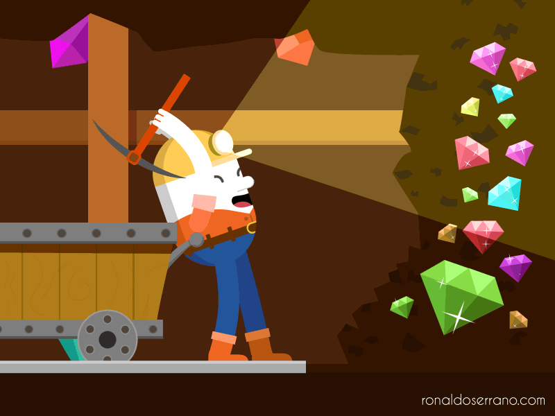

# unit-4-game #

## Overview

This project was designed to demonstrate increased mastery in javascript as well as some beginner implementation of jquery. The assignment was to create a game where users try to match a randomly generated number. 
* * *


## Process

- When the page has been loaded, the user is presented with instructions in the center panel.
- The instructions point towards the gems in the center right panel.
- Users can see the "gem collection target" as well as the "gems collected".
- As the users input by clicking on the crystals, the "gems collected" total will add up.
- Once the added total becomes equal or greater than the "gem collection target", the game will increase wins or losses respectively, then reset.

## Logic

### data:

- "wins" displayed as "Succesful Prospects"
- "losses" displayed as "Failed Prospects"
- "target" displayed as "Gem Collection Target"
- "attempt" displayed as "Gems Collected"
```
    var wins = 0;
    var losses = 0;
    var target = Math.floor(Math.random() * 100) + 19;
    var attempt = 0;
```
- Each gem generate random number
```
    var gem1rando = Math.floor(Math.random() * 13) + 2;
    var gem2rando = Math.floor(Math.random() * 13) + 2;
    var gem3rando = Math.floor(Math.random() * 13) + 2;
    var gem4rando = Math.floor(Math.random() * 13) + 2;
```

### functions:

- randomizer - generates a random number for "target" and each gem
```       
    function randomizer() {
        target = Math.floor(Math.random() * 100) + 19;
        gem1rando = Math.floor(Math.random() * 13) + 2;
        gem2rando = Math.floor(Math.random() * 13) + 2;
        gem3rando = Math.floor(Math.random() * 13) + 2;
        gem4rando = Math.floor(Math.random() * 13) + 2;
    }
```
- resetGame - runs 'randomizer' function, sets "gems collected" to 0, then prints on screen all data
```
    function resetGame() {
        randomizer();
        attempt = 0;
        $(".showTarget").text(target);
        $(".showAttempt").text(attempt);
        $(".showWins").text(wins);
        $(".showLosses").text(losses);
    }
```
- youWin && youLose - increases wins/losses by 1, then replaces central panel with a win/lose image
```
        function youWin() {
            wins++;
            $(".placeholder").html("");
        }

        function youLose() {
            losses++;
            $(".placeholder").html("");
        }
```
- Gemstone .onclick jquery and if/elseif statements for game logic
    - When a gem[1, 2, 3, 4] is clicked, the random number generated at start will add to "attempt"
    - Every click will run an if/elseif conditional on whether:
        1. The attempt is equal to the target
        2. The attempt is greater than the target
    - If any of the conditions are met, the appropriate wins/losses will update, and the function resetGame will run
```

    $("#gem1").on("click", function() {
        attempt += gem1rando;
        $(".showAttempt").text(attempt);
        
            if (attempt === target) {
                youWin();
                $(".showWins").text(wins);
                resetGame();

            } else if (attempt > target) {
                youLose();
                $(".showLosses").text(losses);
                resetGame();
            }
    })
```
- This is an additional .onclick jquery that replaces the initial center panel with a new image
```
$(".gem").on("click", function() {
    console.log("change the image in center");
    $(".placeholder").html("");
})
```

## Methods Used

- Math.random - [JavaScript random()](https://www.w3schools.com/jsref/jsref_random.asp)
- Math.floor - [JavaScript floor()](https://www.w3schools.com/jsref/jsref_floor.asp)
- .on() - [jQuery on()](https://www.w3schools.com/jquery/event_on.asp)
- .html() - [jQuery html()](https://www.w3schools.com/jquery/html_html.asp)
- .text() - [jQuery text()](https://www.w3schools.com/jquery/html_text.asp)

## CDN's Used

- Bootstrap v4.1.0 - [getbootstrap](https://getbootstrap.com/)
- jQuery v3.3.1 (uncompressed) - [jQuery core](https://code.jquery.com/)
- Reset CSS by meyerweb - [meyerweb CSS reset](https://meyerweb.com/eric/tools/css/reset/)


